# Tinkers Reborn

    Make Tinker Great again

```mermaid
flowchart TB
  subgraph Interface
    ToolCore
    WeaponCore
    IToolPart
  end

  subgraph MultiBlock
    Smeltery
    LargeFurnace
  end

  subgraph Item
    subgraph ToolPart
      Shard
      ToolRod
      PickaxeHead
      ShovelHead
      AxeHead
      SwordBlade
      WideGuard
      HandGuard
      CrossBar
      ToolBinding
      Pan
      WideBoard
      KnifeBlade
      ChiselHead
      ToughRod
      ToughBinding
      LargePlate
      BroadaxeHead
      ScytheHead
      ExcavatorHead
      LargeBlade
      HammerHead
      FullGuard
      BowSting
      Fletching
      ArrowHead
      Shaft
      ShurikenPart
      CrossBowLimb
      CrossBowBody
      BowLimb
      BoltCore
    end
    
    subgraph Tool
      Pickaxe
      Hatchet
      Shovel
      Mattock
      Chisel
      LumberAxe
      Excavator
      Hammer

      subgraph Weapon
        BroadSword
        LongSword
        Rapier
        FryingPan
        BattleSign
        Dagger
        Scythe
        Cleaver
        BattleAxe
        Shuriken
        ThrowingKnife
        Javelin
        ShortBow
        LongBow
        CrossBow
        Cutlass
        Arrow
        Bolt
      end

    end
  end

  subgraph Block
    subgraph GeneralBlock
      SlimeGrass
      SlimeDirt
      SlimeSoil
      SlimyMud
      Grout
      GraveyardSoil
      ConsecratedSoil
      SearedBricks
    end

    subgraph WorkingBlock
      ToolStation
      ToolForge
      PartBuilder
      PatternChest
      PartChest
      StencilTable
      CraftingStation
      FurnaceController
      SmelteryController
      SmelteryDrain
      SearedTank
      SearedGlass
      SearedWindow
      CastingTable
      SearedFaucet
      CastingBasin
      CastingChannel
    end

  end

  subgraph WorldGen
    Village
    SlimeIsland
    Ore
  end

  
  Pickaxe --> ToolCore
  Pickaxe --> PickaxeHead
  Pickaxe --> ToolBinding
  Pickaxe --> ToolRod

  Hatchet --> ToolCore
  Hatchet --> AxeHead
  Hatchet --> ToolRod
  
  Shovel --> ToolCore
  Shovel --> ShovelHead
  Shovel --> ToolRod

  Mattock --> ToolCore
  Mattock --> ShovelHead
  Mattock --> AxeHead
  Mattock --> ToolRod

  Chisel --> ToolCore
  Chisel --> ChiselHead
  Chisel --> ToolRod

  LumberAxe --> ToolCore
  LumberAxe --> BroadaxeHead
  LumberAxe --> LargePlate
  LumberAxe --> ToughRod
  LumberAxe --> ToughBinding

  Excavator --> ToolCore
  Excavator --> ExcavatorHead
  Excavator --> LargePlate
  Excavator --> ToughRod
  Excavator --> ToughBinding

  Hammer --> ToolCore
  Hammer --> HammerHead
  Hammer --> LargePlate
  Hammer --> ToughRod
  Hammer --> ToughBinding

  Scythe --> WeaponCore
  Scythe --> ScytheHead
  Scythe --> LargePlate
  Scythe --> ToughRod
  Scythe --> ToughBinding

  WeaponCore --> ToolCore

  BroadSword --> WeaponCore
  BroadSword --> SwordBlade
  BroadSword --> WideGuard
  BroadSword --> ToolRod

  LongSword --> WeaponCore
  LongSword --> SwordBlade
  LongSword --> HandGuard
  LongSword --> ToolRod

  Rapier --> WeaponCore
  Rapier --> SwordBlade
  Rapier --> CrossBar
  Rapier --> ToolRod

  FryingPan --> WeaponCore
  FryingPan --> Pan
  FryingPan --> ToolRod

  BattleSign --> WeaponCore
  BattleSign --> WideBoard
  BattleSign --> ToolRod

  Dagger --> WeaponCore
  Dagger --> KnifeBlade
  Dagger --> CrossBar
  Dagger --> ToolRod

  Cleaver --> WeaponCore
  Cleaver --> LargeBlade
  Cleaver --> LargePlate
  Cleaver --> ToughRod

  BattleAxe --> WeaponCore
  BattleAxe --> BroadaxeHead
  BattleAxe --> ToughRod
  BattleAxe --> ToughBinding

  Shuriken --> WeaponCore
  Shuriken --> ShurikenPart

  ThrowingKnife --> WeaponCore
  ThrowingKnife --> KnifeBlade
  ThrowingKnife --> ToolRod

  Javelin --> WeaponCore
  Javelin --> ArrowHead
  Javelin --> ToughRod

  ShortBow --> WeaponCore
  ShortBow --> BowLimb
  ShortBow --> BowSting

  LongBow --> WeaponCore
  LongBow --> BowLimb
  LongBow --> BowSting
  LongBow --> LargePlate

  CrossBow --> WeaponCore
  CrossBow --> CrossBowLimb
  CrossBow --> CrossBowBody
  CrossBow --> BowSting
  CrossBow --> ToughBinding

  Cutlass --> WeaponCore
  Cutlass --> SwordBlade
  Cutlass --> FullGuard
  Cutlass --> ToolRod

  Arrow --> WeaponCore
  Arrow --> ArrowHead
  Arrow --> Shaft
  Arrow --> Fletching

  Bolt --> WeaponCore
  Bolt --> BoltCore
  Bolt --> Fletching

  SmelteryController --> Smeltery
  SmelteryDrain --> Smeltery
  SearedTank --> Smeltery
  SearedGlass --> Smeltery
  SearedWindow --> Smeltery
  CastingTable --> Smeltery
  SearedFaucet --> Smeltery
  CastingBasin --> Smeltery
  CastingChannel --> Smeltery
  SearedBricks --> Smeltery

  FurnaceController --> LargeFurnace
  SearedTank --> LargeFurnace

  Smeltery --> Village

  SlimeGrass --> SlimeIsland
  SlimeDirt --> SlimeIsland
  SlimeSoil --> SlimeIsland
  SlimyMud --> SlimeIsland

```



## NBT

```json

"TinkersRebornTool":{
  // actual render materials identifier in order
  "RenderMaterials":["wood", "wood", "obsidian"],
  // materials identifier in order READONLY
  "Materials":["iron", "wood", "obsidian"],
  // TODO
  "Modifiers":[
    {
      "identifier":"haste",
      "color":9502720,
      "type":"modify"
    },
    {
      "identifier":"ecological",
      "color":-7444965,
      "type":"trait"
    }
  ],
  // this tool's now stats
  "Stats":{
    "Durability": 1,
    "Attack": 2.1,
    "MiningSpeed": 2.2,
    "HarvestLevel": 3,
    "ModifierSlots": 3, // this never change
    "ExtraModifiers": 10, // this add by modifier/trait/level up
    "UsedModifiers": 0
  },
  // this tool's base stats READONLY
  "StatsOriginal":{
    "Durability": 0.5,
    "Attack": 2.1,
    "MiningSpeed": 1.0,
    "HarvestLevel": 3,
    "ModifierSlots": 3,
    "ExtraModifiers": 0,
    "UsedModifiers": 0
  },
  // for some traits data
  "Special":{
    "alien":{
      "pool":{
        "durability":282,
        "attack":1.349999,
        "speed":1.7359989
      },
      "bonus":{
        "durability":19,
        "attack":0.110000014,
        "speed":0.14
      }
    }
  },
  "CategoryList": ["harvest", "tool"],
  // 1 broken, 0 not broken, use boolean
  "Broken":0,
  "Unbreakable":1,
  "RepairCount":10
}

```

## TODO

- [ ] furnace
- [ ] smeltery
- [ ] harvest level function

## TOOL and WEAPON

### Pickaxe

  not special

### Shovel

  damage * 0.9

### Hatchet

  knock back * 1.3

  damage * 1.1

  base damage + 0.5

  breaking leaves does not reduce durability

### Mattock

  mining speed * 0.95

  damage * 0.9

  knock back * 1.1

  base damage + 3
  
  use like hoe

### Kama

  harvest crop then replant them

  work as scissors

### Hammer

  mining speed * 0.4

  damage * 1.2

  extra [3,7) damage to UNDEAD

  Durability * 2.5

  use hammer head's material fix can get 2.5x durability, large plate's material can fix 1.5x

### Excavator

  mining speed * 0.28

  damage * 1.25

  Durability * 1.75

  use excavator head's material fix can get 1.75x durability, large plate's material can fix 1.3125x

### LumberAxe

  mining speed * 0.35

  damage * 1.2

  knock back * 1.5

  base damage + 2

  chop the whole tree

### Scythe

  Durability * 2.2

  like Kama but have aoe(have some bug...)
  
  may need balance

### BroadSword

  Durability * 1.5

  sweep damage to entity near by target

  base damage + 1

### LongSword

  Durability * 1.05

  damage cutoff over 18

  damage * 1.1

  base damage + 0.5

  rush

### Rapier

  Durability * 0.8

  damage * 0.55

  damage cutoff over 13

  knock back * 0.6

  half damage will by pass armor

### Cleaver

  Durability * 2

  damage * 1.2

  damage cutoff over 25

  use large blade's material fix can get 2x durability, large plate's material can fix 1.5x

  (base damage * 1.3) + 3

  (ModBeheading have some issue wait to fix)
